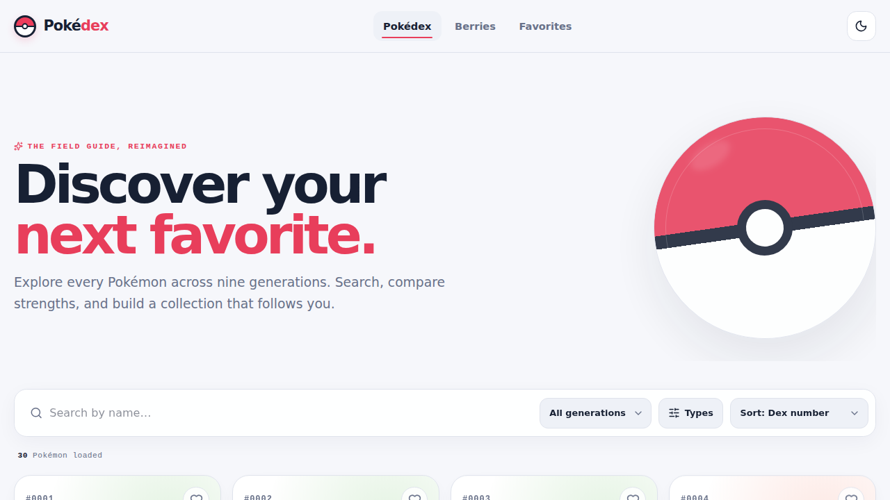
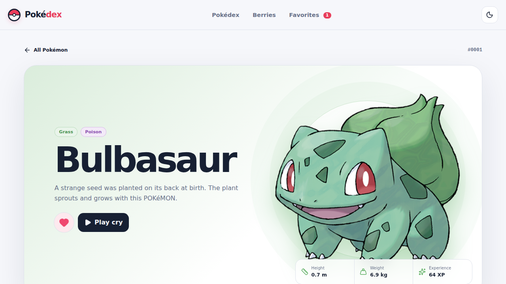
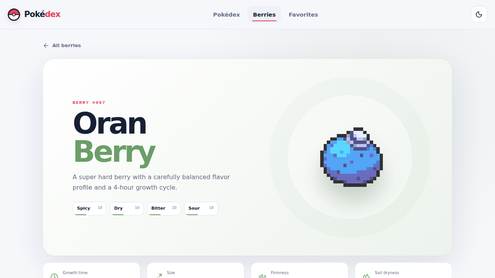

<div align="center">
  
  <h1>Pokédex</h1>
  <p><strong>A field guide with a pulse.</strong><br />Explore, compare, hear, and collect Pokémon in a tactile SvelteKit experience.</p>

[](https://azagatti.github.io/pokedex-gpt-sol-med/)

[](https://svelte.dev/docs/kit) [](https://www.typescriptlang.org/) [](https://tailwindcss.com/) [](https://github.com/AZagatti/pokedex-gpt-sol-med/actions/workflows/deploy.yml) [](https://azagatti.github.io/pokedex-gpt-sol-med/)
</div>



## The experience

- Infinite, cached discovery grid with artwork, types, Dex numbers, and tactile card motion
- Debounced substring search, generations 1–9, 18 intersecting type filters, and stat-total sorting
- Rich Pokémon profiles with animated stats, abilities, example moves, evolutions, sprite variants, and real cries
- Searchable berry garden with growth, size, firmness, soil, and flavor details
- Device-persisted favorites and a no-flash light/dark theme
- Responsive keyboard-first navigation, strong focus states, meaningful alt text, reduced-motion support, and branded failure states

<table>
  <tr>
    <td></td>
    <td></td>
  </tr>
  <tr>
    <td align="center"><strong>Every detail, alive</strong></td>
    <td align="center"><strong>A garden of useful data</strong></td>
  </tr>
</table>

## Stack

SvelteKit 2 · Svelte 5 runes · strict TypeScript · adapter-static · Tailwind CSS v4 · authored motion CSS · Lucide · Zod · native fetch · Vitest · Playwright · Ultracite/Oxlint/Oxfmt · Lefthook · GitHub Actions/Pages.

## Run locally

```bash
npm ci
npx playwright install chromium
npm run dev
```

Open `http://localhost:5173`. Production confidence checks:

```bash
npm run lint
npm run format
npm run check
npm run test
npm run build
```

## Architecture

All PokéAPI access crosses a Zod-validated boundary and a URL-keyed in-memory cache. Static routes are prerendered; dynamic detail routes use the GitHub Pages `404.html` SPA fallback. Svelte stores own only the two genuinely global concerns—theme and favorites—while route-local behavior stays in Svelte 5 runes.

Read the deeper [architecture](docs/ARCHITECTURE.md) and the rationale behind every [technical decision](docs/DECISIONS.md).

## Quality

The test suite drives the production build in Chromium: search, filtering, detail navigation, sprite switching, favorite persistence, theme persistence, berry discovery, and 404 behavior. Screenshots in [`docs/screenshots`](docs/screenshots/) are generated by those same journeys, so the portfolio evidence and regression checks stay aligned.

Regenerate the committed captures intentionally with `UPDATE_SCREENSHOTS=1 npm run test:e2e`.

<div align="center"><sub>Data and artwork from <a href="https://pokeapi.co/">PokéAPI</a>. Pokémon is © Nintendo/Creatures Inc./GAME FREAK inc.</sub></div>
