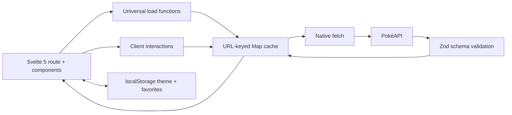

# Architecture

## Runtime shape

The app is a static SvelteKit SPA deployed below the `/pokedex-gpt-sol-med` project path. Static entry routes are prerendered, while Pokémon and berry detail routes resolve in the browser through the generated `404.html` fallback. This gives GitHub Pages reliable deep links without a server runtime.

## Data flow

Every external response is parsed by a shape-specific Zod schema before it enters the cache. The cache deduplicates detail requests shared by the list, filters, favorites, and evolution chains for the lifetime of a browser session.

## Routes

| Route | Rendering | Responsibility |
| --- | --- | --- |
| `/` | prerendered shell + client updates | Infinite Pokédex, search, filters, sorting |
| `/pokemon/[name]` | SPA fallback | Detail, stats, audio, sprites, evolution |
| `/berries` | prerendered | Searchable berry garden |
| `/berries/[name]` | SPA fallback | Berry facts and flavors |
| `/favorites` | prerendered shell | Device-persisted collection |
| fallback | SPA fallback | Branded accessible error page |

## State and resilience

Component-local interaction state uses Svelte 5 runes. Theme and favorite names use small Svelte stores synchronized to `localStorage`. Routes provide empty, loading, retryable error, and missing-resource states. Reduced-motion preferences collapse all nonessential transitions.
